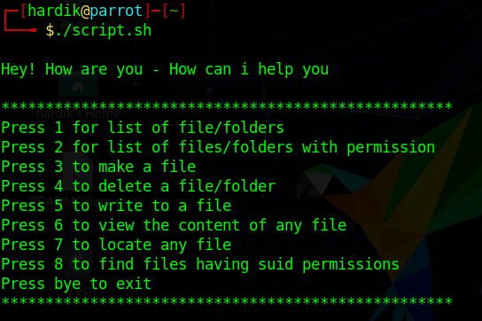

# Linux-enlister
This is a tool which helps a user to perform some basic commands in linux 

# Usage 

**git clone https://github.com/Har1743/Linux-enlister.git**  

And then just run using  
**./linux-enlister.sh**

# Screenshot

# Created by

github : [Har1743](https://github.com/Har1743)

# Advantages

1. It is user friendly.
2. Reduces the user work as user does not need to enter the long commands. 

